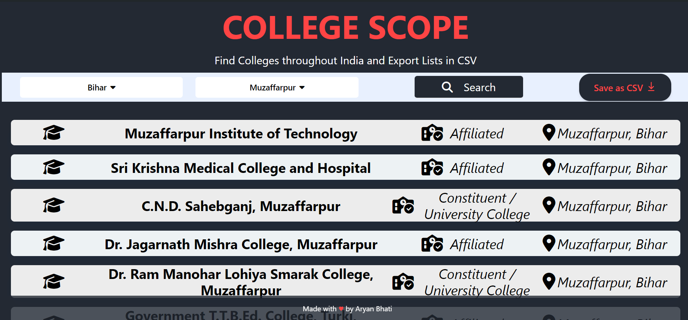

# CollegeScope 
## Find Colleges Worldwide and Export Lists in CSV

This project is a comprehensive tool for finding colleges all over India. It allows users to search for colleges in India by State and District and export the results in a CSV format. This project was created to enhance my JavaScript skills. 💻

## Screenshot 📸



## Deployed Link 🌐

The website is hosted at: 👉 [CollegeScope](https://collegescope.onrender.com/)

## Table of Contents

- [Project Structure](#project-structure)
- [Technologies Used](#technologies-used-)
- [Deployed Link](#deployed-link-)
- [Description](#description-)
- [Features](#features-)
- [Screenshot](#screenshot-)
- [Getting Started](#getting-started-)
- [Usage](#usage-)
- [Contributing](#contributing-)
- [Acknowledgments](#acknowledgments-)

## Project Structure

- **index.html**: The main HTML file.
- **style.css**: The CSS file containing the styles for the page.
- **app.js**: The JS file containing the main logic behind the application.
- **index.js** : This JS File consists the routings of the project. It returns the GET requests of colleges.

## Technologies Used 🛠️

- HTML
- Tailwind CSS
- JavaScript
- NodeJS
- Express

## Description 📝

CollegeScope is a user-friendly web application that allows users to search for colleges worldwide. It provides detailed information about each college, including the name, state, and website. Users can also export the search results in a CSV format for further analysis or record-keeping.

## Features ✨

- User-friendly interface
- Search for colleges by State and Districts
- Export search results in CSV format
- Navigate through all states and their districts seamlessly with the help of a smooth search experience.

## Getting Started 🏁

To run the project locally, follow these steps:

1. Clone the repository:

```bash
git clone https://github.com/AryanBhati7/CollegeScope
```

To run the project locally, follow these steps:

2. Navigate to the project directory:

```bash
cd CollegeScope
```

3. Install the required Node modules:

```bash
npm install
```

4. Run the Node Server :

```bash
node index.js
```
or

```bash
nodemon index.js
```

5. Open the **index.html** file in your preferred web browser

   or

Search this on your preferred browser :

```bash
localhost:3001
```
